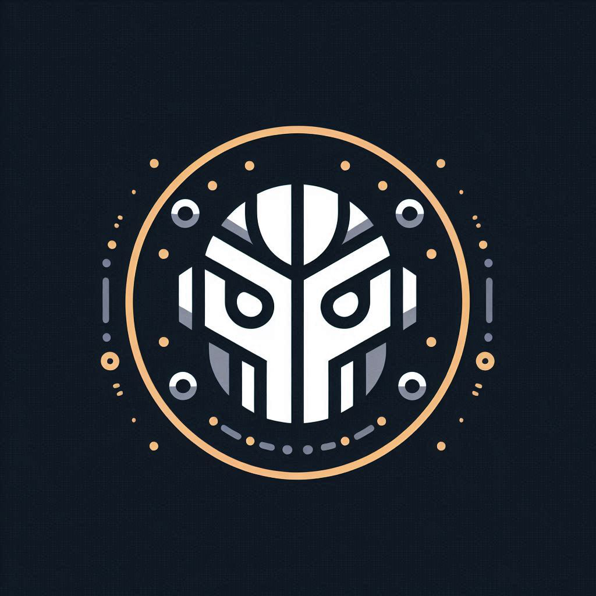

<div align="middle">
    <h1>
        <p>
            
        </p>
        🤖 Discord (Music) Bot
        <br>
        <a href="https://github.com/psf/black">
            
        </a>
        <a>
            
        </a>
        <a>
            
        </a>
        <a>
            
        </a>
    </h1>
</div>

This repository contains code to build a music bot for any Discord servers, allowing users to stream their favorite YouTube music directly in voice channels.

## Features 🎶

The Discord bot supports the following commands:

| Commands                                              |                                                                                                     |
| :---------------------------------------------------- | --------------------------------------------------------------------------------------------------- |
| !add &lt;url&gt;                                      | Adds a YouTube audio source to the playlist.                                                        |
| !help                                                 | Displays a list of available commands.                                                              |
| !id &lt;type&gt;                                      | Displays role or text channel IDs.                                                                  |
| !join                                                 | Makes the bot join the author's current voice channel.                                              |
| !leave                                                | Disconnects the bot from the voice channel.                                                         |
| !pause                                                | Pauses the currently playing audio source.                                                          |
| !permission &lt;type&gt;                              | Displays the roles allowed to use each command or the text channels where each command can be used. |
| !play                                                 | Starts playing the audio source from the playlist.                                                  |
| !reset                                                | Stops the currently played audio source and clears the playlist.                                    |
| !role &lt;cmd&gt; &lt;id1&gt; ... &lt;idN&gt;         | Whitelists specified roles for a command.                                                           |
| !show &lt;n&gt;                                       | Lists the audio sources in the playlist.                                                            |
| !skip                                                 | Skips the currently playing audio source.                                                           |
| !text_channel &lt;cmd&gt; &lt;id1&gt; ... &lt;idN&gt; | Whitelists specified text channels for a command.                                                   |
| !timeout &lt;ts&gt;                                   | Adjusts the bot's timeout duration.                                                                 |
| !volume &lt;vol&gt;                                   | Modifies the playback volume of the audio source.                                                   |

### Build the Discord Bot via Docker 🐳

1. **Clone the Repository**

Clone the repository to your local machine:

```bash
git clone https://github.com/nobodyPerfecZ/discord-bot.git
```

2. **Adjust the config.yaml file**

The `config.yaml` file defines the bot's default settings, including which roles are allowed to use specific commands and in which text channels commands can be executed.

Since each role and text channel in Discord has a unique ID, you need to customize the `config.yaml` file to match your server's configuration. This ensures the bot operates correctly within your Discord server.

3. **Add your Discord Token to compose.yaml file**

In the `compose.yaml` file, locate the `TOKEN` key and add your Discord API token there. This token is required for the bot to connect to your Discord server.

4. **Build application with Docker**

Ensure Docker and Docker Compose are installed on your system. If not, refer to the [Docker installation guide](https://docs.docker.com/engine/install/). Once installed, you can build and run the Discord bot using Docker Compose with the following command:

```bash
sudo docker compose up -d --build
```

After running this command, the Discord bot should start and appear online in your Discord server.

## Development 🔧

Contributions are welcome! Please fork the repository and submit a pull request.
Make sure to follow the coding standards and write tests for any new features or bug fixes.
